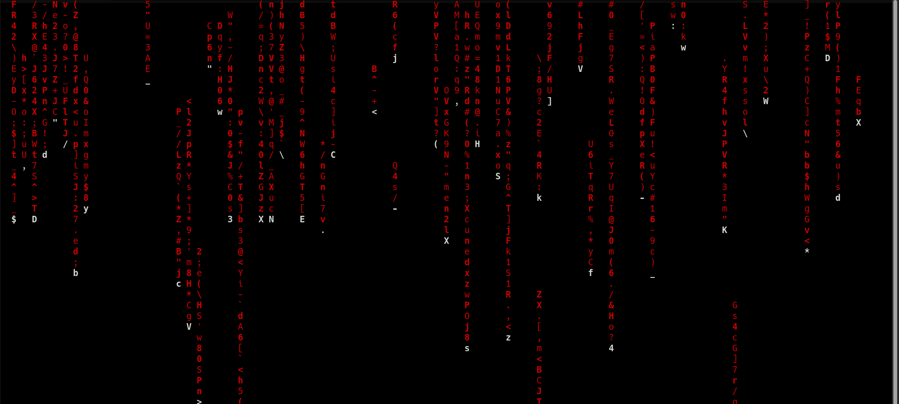

### 📌 Dockerized CMatrix
---
**Goal:** create a Docker image that runs cmatrix — the classic Matrix-style terminal screensaver.

### 👉 Demonstration
By running the commands:

```bash
docker build -t cmatrix .
docker run -it cmatrix
```

A cmatrix container is built from a custom minimal Alpine image that has cmatrix installed, after the container is executed, it will display the falling green characters animation in the terminal.


---
