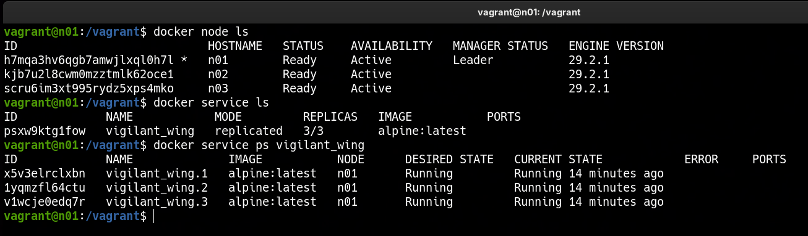

### 🐳 3-Node Docker Swarm Cluster
---
**Goal:** spin up a 3-node Docker Swarm cluster with Vagrant, initialize the manager, and join two workers to the swarm.

### 👉 Demonstration
By running the commands:

```bash
vagrant up
vagrant ssh n01
docker node ls
```

Vagrant provisions three Ubuntu VMs (n01, n02, n03) on a private network. Node `n01` initializes the Swarm manager and shares the join token through a shared folder, while `n02` and `n03` wait for the token and automatically join the cluster as workers. Once joined, `docker node ls` from `n01` shows the manager and both workers ready in the cluster.


---
