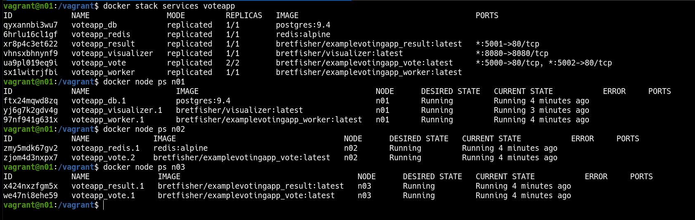
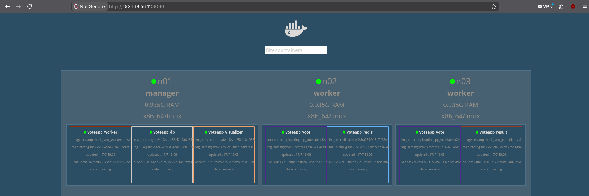

### 🐳 Docker Swarm Stacks
---
**Goal:** spin up a 3-node Docker Swarm cluster with Vagrant and deploy a multi-service application via `docker stack deploy` using a declarative Compose file.

### 👉 Demonstration
By running the commands:

```bash
vagrant up
vagrant ssh n01
docker stack services voteapp
```

Vagrant provisions three Ubuntu VMs (n01, n02, n03) on a private network. Node `n01` initializes the Swarm manager, shares the join token, and `n02` and `n03` automatically join the cluster as workers. Once joined, `n01` deploys the full voting app stack (`docker-stack.yaml`) with services `vote`, `redis`, `worker`, `db`, `result`, and `visualizer`, using overlay networks `frontend` and `backend`, placement constraints, and update policies. `docker stack services voteapp` shows the stack and all its services running across the cluster.



---
