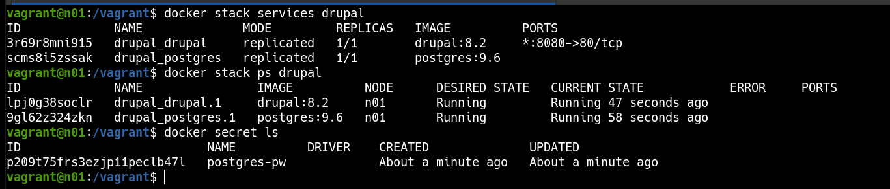

### 🐳 Docker Swarm Secrets
---
**Goal:** spin up a single-node Docker Swarm cluster with Vagrant, create a Docker secret (`postgres-pw`) holding a randomly generated PostgreSQL password, and deploy a Drupal + PostgreSQL stack that mounts the secret into the `postgres` container.

### 👉 Demonstration
By running the commands:

```bash
vagrant up
```

Vagrant provisions a single Ubuntu VM (n01). The provisioning script `swarm.sh` initializes a single-node Swarm, generates a random 16-character password with `openssl`, and stores it as a Docker secret named `postgres-pw`. After the VM is up, the Vagrant `after :up` trigger automatically deploys the `docker-stack.yaml` stack, which launches Drupal (port 8080) and PostgreSQL. The Postgres container reads the password from `/var/run/secrets/postgres-pw`, keeping credentials out of the compose file. `docker stack services drupal` confirms both services are running.


---
