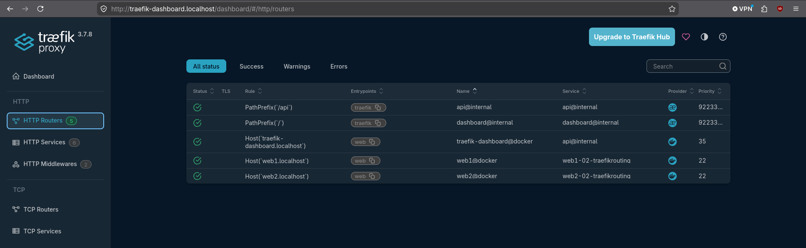
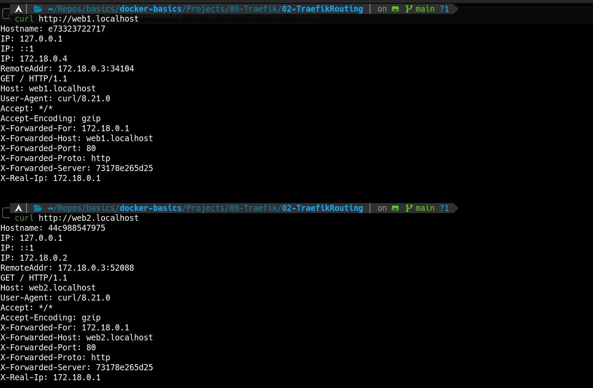
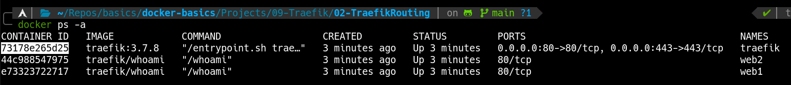
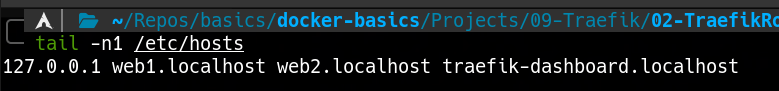

### 🛞 Traefik Routing — Host-based Router Rules
---
**Goal:** spin up Traefik as a reverse proxy and route requests to backend services (`web1`, `web2`) and the dashboard based on the `Host` header, using Docker container labels for dynamic configuration.

### 👉 Demonstration
By running the commands:

```bash
docker compose up -d
curl http://web1.localhost
curl http://web2.localhost
```

The `docker-compose.yaml` starts Traefik alongside two `traefik/whoami` containers (`web1` and `web2`). Traefik publishes ports `80` and `443` directly (no remapping), and the dashboard is now accessible only via the `traefik-dashboard.localhost` hostname routed through the `web` entrypoint — the insecure `:8080` port is disabled. Each service declares a router rule through container labels: `web1` responds to `web1.localhost`, `web2` to `web2.localhost`, and the dashboard to `traefik-dashboard.localhost`. These hostnames are resolved locally via `/etc/hosts` pointing to `127.0.0.1`. Curling any of these domains on port `80` hits the corresponding service, and the response includes the `X-Forwarded-Server` header with Traefik's container ID.





---
