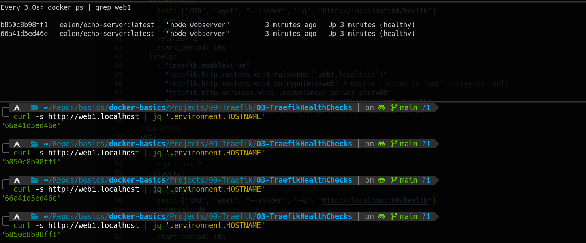
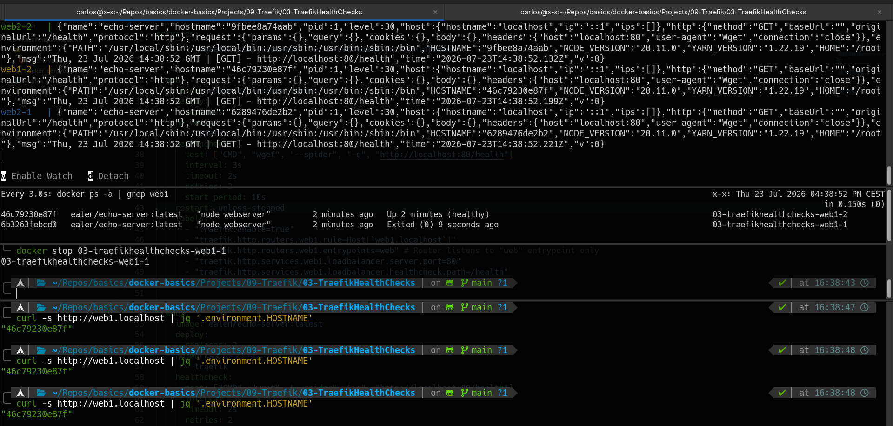

### 🛞 Traefik Health Checks
---
**Goal:** spin up Traefik as a reverse proxy with two replicas of a backend service (`web1`), each running a Docker-level healthcheck and a Traefik load-balancer healthcheck, so that unhealthy containers are automatically removed from the routing pool and re-added once they recover.

### 👉 Demonstration
By running the commands:

```bash
docker compose up -d
curl -s http://web1.localhost | jq '.environment.HOSTNAME'
```

The `docker-compose.yaml` starts Traefik alongside two replicas of `ealen/echo-server` (`web1`). Each replica declares a Docker `healthcheck` (`wget --spider` against `/health` every 3s) and Traefik-level load-balancer health labels (`loadbalancer.healthcheck.path=/health`, interval `2s`). Curling `web1.localhost` repeatedly returns alternating container hostnames, confirming round-robin load balancing across both healthy replicas. Stopping one container causes Traefik to route all traffic exclusively to the remaining healthy replica. Once the stopped container is started again and passes its healthcheck, Traefik resumes distributing requests across both backends.

### 👉 Two Complementary Health Checks

This project demonstrates how Docker-level and Traefik-level health checks work together:

- **Docker healthcheck** (`healthcheck:` in Compose) — monitors the container itself. If the check fails, Docker marks the container as `unhealthy` in `docker ps` and, combined with a restart policy, can automatically restart it. This is about **container lifecycle**.
- **Traefik load-balancer healthcheck** (`loadbalancer.healthcheck.*` labels) — monitors backends from Traefik's perspective. If a backend fails the check, Traefik stops routing traffic to it without restarting the container. This is about **traffic routing**.

Together they cover different failure scenarios: Docker restarts containers that are truly broken, while Traefik removes slow or unresponsive backends from the pool even if the container is still running. One manages the infrastructure, the other manages the traffic.



---
